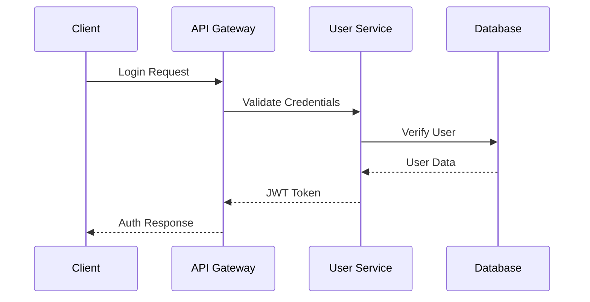
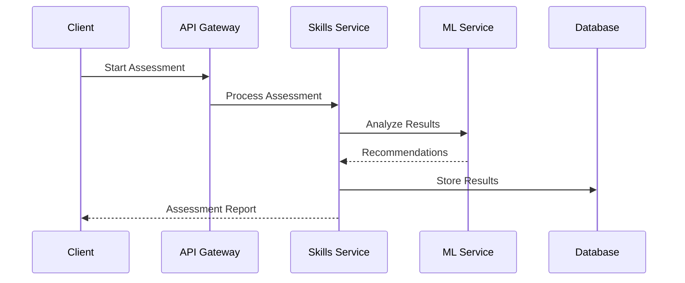

# Technical Requirements and Architecture Specification

## System Overview

The Career Management Platform is a cloud-native SaaS application designed to provide comprehensive career development services for technology professionals. The system follows a microservices architecture deployed on AWS, emphasizing scalability, maintainability, and global accessibility.

## High-Level Architecture

### System Components

1. **Client Layer**
   - Web Application (React)
   - Mobile Applications (Flutter)
   - Admin Dashboard (React)

2. **API Gateway Layer**
   - AWS API Gateway
   - Rate Limiting
   - Request/Response Transformation
   - Authentication/Authorization

3. **Microservices Layer**
   - Independent services (detailed below)
   - Event-driven communication
   - Domain-driven design

4. **Data Layer**
   - Primary Database (PostgreSQL)
   - Cache Layer (Redis)
   - Document Store (MongoDB)
   - Search Engine (Elasticsearch)

5. **External Integration Layer**
   - Third-party APIs
   - Payment Gateways
   - Learning Platforms
   - Job Boards

## Detailed Microservices Architecture

### 1. User Management Service
- **Responsibility**: Handle user authentication, authorization, and profile management
- **Tech Stack**:
  - Language: Python/Flask
  - Database: PostgreSQL
  - Cache: Redis
- **Key Features**:
  - User registration/login
  - Profile management
  - OAuth integration
  - Role-based access control
- **APIs**:
  ```
  POST /api/auth/register
  POST /api/auth/login
  GET /api/users/{userId}
  PUT /api/users/{userId}
  ```

### 2. Skills Assessment Service
- **Responsibility**: Manage skill evaluations and recommendations
- **Tech Stack**:
  - Language: Python/FastAPI
  - Database: MongoDB
  - ML Framework: TensorFlow
- **Key Features**:
  - Skill assessment tests
  - Gap analysis
  - Personalized recommendations
- **APIs**:
  ```
  POST /api/skills/assess
  GET /api/skills/recommendations
  GET /api/skills/gaps
  ```

### 3. Career Path Service
- **Responsibility**: Handle career progression and planning
- **Tech Stack**:
  - Language: Node.js/Express
  - Database: PostgreSQL
  - Cache: Redis
- **Key Features**:
  - Career path mapping
  - Milestone tracking
  - Progress monitoring
- **APIs**:
  ```
  GET /api/careers/paths
  POST /api/careers/goals
  GET /api/careers/progress
  ```

### 4. Learning Management Service
- **Responsibility**: Manage learning resources and progress
- **Tech Stack**:
  - Language: Python/Django
  - Database: PostgreSQL & MongoDB
  - Search: Elasticsearch
- **Key Features**:
  - Course management
  - Progress tracking
  - Certification handling
- **APIs**:
  ```
  GET /api/learning/courses
  POST /api/learning/enroll
  GET /api/learning/progress
  ```

### 5. Job Market Intelligence Service
- **Responsibility**: Process and provide job market insights
- **Tech Stack**:
  - Language: Python/FastAPI
  - Database: MongoDB
  - Analytics: Apache Spark
- **Key Features**:
  - Market trend analysis
  - Salary insights
  - Demand forecasting
- **APIs**:
  ```
  GET /api/market/trends
  GET /api/market/salaries
  GET /api/market/demand
  ```

### 6. Networking Service
- **Responsibility**: Handle user connections and mentorship
- **Tech Stack**:
  - Language: Node.js/Express
  - Database: Neo4j
  - Cache: Redis
- **Key Features**:
  - Mentor matching
  - Community management
  - Event organization
- **APIs**:
  ```
  POST /api/network/connect
  GET /api/network/mentors
  GET /api/network/events
  ```

### 7. Content Management Service
- **Responsibility**: Manage all content and resources
- **Tech Stack**:
  - Language: Node.js/Express
  - Database: MongoDB
  - Storage: AWS S3
- **Key Features**:
  - Content creation
  - Resource management
  - Media handling
- **APIs**:
  ```
  POST /api/content/create
  GET /api/content/resources
  PUT /api/content/update
  ```

### 8. Analytics Service
- **Responsibility**: Handle system-wide analytics
- **Tech Stack**:
  - Language: Python/FastAPI
  - Database: ClickHouse
  - Stream Processing: Apache Kafka
- **Key Features**:
  - User behavior analysis
  - Performance metrics
  - Usage statistics
- **APIs**:
  ```
  POST /api/analytics/event
  GET /api/analytics/reports
  GET /api/analytics/metrics
  ```

## Data Flow Architecture

### 1. Authentication Flow


### 2. Skills Assessment Flow


## Infrastructure Architecture

### AWS Services Utilized
- **Compute**:
  - ECS/EKS for container orchestration
  - Lambda for serverless functions
  - EC2 for specific workloads

- **Storage**:
  - S3 for object storage
  - EFS for file system needs
  - RDS for relational databases

- **Networking**:
  - VPC for network isolation
  - Route 53 for DNS management
  - CloudFront for CDN

- **Security**:
  - WAF for web application firewall
  - Shield for DDoS protection
  - KMS for key management

## Security Architecture

### 1. Authentication & Authorization
- JWT-based authentication
- OAuth 2.0 integration
- Role-based access control (RBAC)
- Multi-factor authentication (MFA)

### 2. Data Security
- End-to-end encryption
- Data encryption at rest
- Secure API communication
- Regular security audits

### 3. Compliance
- GDPR compliance
- CCPA compliance
- SOC 2 compliance
- Regular compliance audits

## Monitoring and Observability

### 1. Metrics Collection
- Application metrics
- Infrastructure metrics
- Business metrics
- User behavior metrics

### 2. Logging
- Centralized logging
- Log aggregation
- Log analysis
- Alert configuration

### 3. Tracing
- Distributed tracing
- Performance monitoring
- Error tracking
- User session tracking

## Deployment Strategy

### 1. CI/CD Pipeline
- Source control (GitHub)
- Automated testing
- Containerization
- Infrastructure as Code

### 2. Environment Strategy
- Development
- Staging
- Production
- Disaster Recovery

## Scalability Considerations

### 1. Horizontal Scaling
- Auto-scaling groups
- Load balancing
- Database sharding
- Caching strategies

### 2. Performance Optimization
- CDN implementation
- Database optimization
- Cache utilization
- Code optimization

## Disaster Recovery

### 1. Backup Strategy
- Regular database backups
- Cross-region replication
- Point-in-time recovery
- Backup testing

### 2. Recovery Plan
- RTO/RPO definitions
- Failover procedures
- Recovery testing
- Incident response

## Development Guidelines

### 1. Coding Standards
- Language-specific guidelines
- Code review process
- Documentation requirements
- Testing requirements

### 2. API Standards
- RESTful design principles
- API versioning
- Error handling
- Rate limiting

## Future Considerations

### 1. Technical Debt Management
- Regular code reviews
- Dependency updates
- Architecture reviews
- Performance optimization

### 2. Feature Roadmap
- AI/ML integration
- Blockchain integration
- IoT device support
- Advanced analytics
