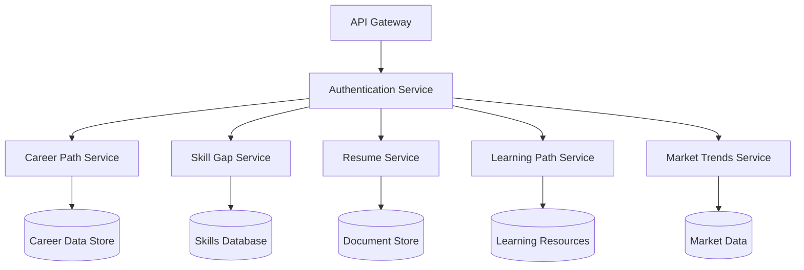
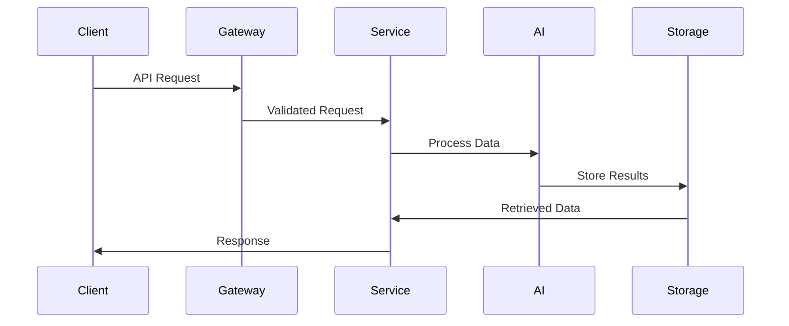
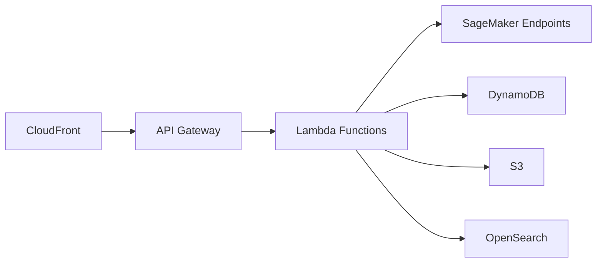

# AI Microservices Technical Specification

## Core AI Services

### 1. Career Path Prediction Service
- **Endpoint**: `/api/v1/career-prediction`
- **Purpose**: Analyze user profile, skills, and market trends to predict optimal career paths
- **Input**: User profile, skills, interests, academic history
- **Output**: Ranked career paths with confidence scores and skill requirements
- **AI Models**: LLM for analysis, recommendation systems for path matching
- **AWS Services**: SageMaker, Lambda, API Gateway

### 2. Skill Gap Analysis Service
- **Endpoint**: `/api/v1/skill-gap`
- **Purpose**: Identify gaps between user skills and job requirements
- **Input**: User skills, target job requirements
- **Output**: Detailed gap analysis, recommended learning paths
- **AI Models**: NLP for skill matching, classification models
- **AWS Services**: Comprehend, Lambda, DynamoDB

### 3. Resume Enhancement Service
- **Endpoint**: `/api/v1/resume-enhance`
- **Purpose**: Optimize resume content and format
- **Input**: Raw resume text/PDF
- **Output**: Enhanced resume with suggestions
- **AI Models**: NLP for content optimization, GPT for writing improvements
- **AWS Services**: Textract, Lambda, S3

### 4. Personalized Learning Path Service
- **Endpoint**: `/api/v1/learning-path`
- **Purpose**: Generate customized learning recommendations
- **Input**: User profile, career goals, current skills
- **Output**: Structured learning path with resources
- **AI Models**: Recommendation systems, sequence prediction
- **AWS Services**: SageMaker, Neptune, Lambda

### 5. Job Market Trends Analysis
- **Endpoint**: `/api/v1/market-trends`
- **Purpose**: Real-time analysis of job market trends
- **Input**: Industry, location, time period
- **Output**: Trend analysis, demand forecasts
- **AI Models**: Time series prediction, trend analysis
- **AWS Services**: Forecast, Lambda, OpenSearch

## Technical Architecture

### Microservices Design

### Data Flow Architecture

### Deployment Architecture

## Implementation Guidelines

### Service Configuration
- Use AWS CloudFormation for infrastructure
- Implement API versioning
- Enable CORS for cross-origin requests
- Set up rate limiting and quotas
- Configure CloudWatch monitoring

### Security Measures
- JWT authentication
- IAM roles per service
- VPC isolation
- API key management
- Data encryption at rest and transit

### Scalability
- Auto-scaling policies for Lambda
- DynamoDB on-demand capacity
- SageMaker endpoint auto-scaling
- CloudFront edge caching
- Read replicas for databases

## Monitoring and Administration

### Admin Dashboard Features
- Service health monitoring
- API usage analytics
- Error tracking and logging
- Model performance metrics
- Resource utilization stats
- User activity monitoring
- Configuration management
- Access control management

### Alerting System
- CloudWatch alarms
- SNS notifications
- Error rate thresholds
- Performance degradation alerts
- Cost optimization warnings
