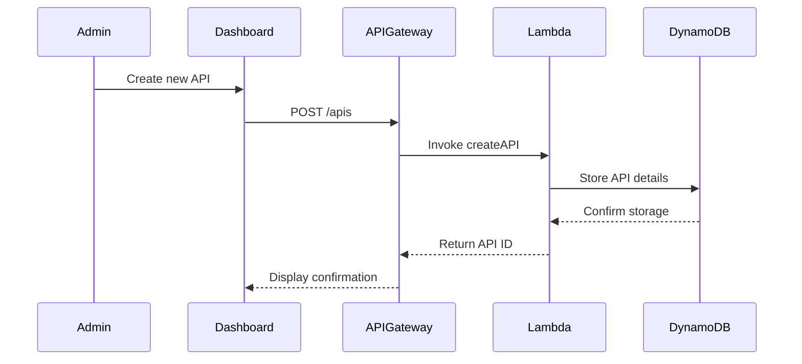
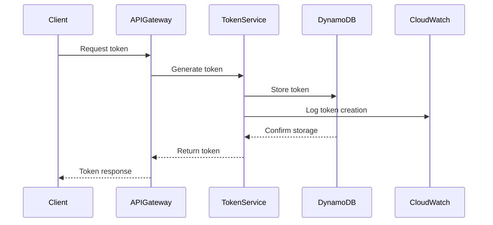

# API Management Service Documentation

## Architecture Overview

### Components
```
├── API Gateway (Frontend Interface)
│   ├── /apis - API Registry endpoints
│   ├── /tokens - Token management endpoints
│   └── /metrics - Monitoring endpoints
│
├── Lambda Functions (Business Logic)
│   ├── APIManagementService
│   ├── TokenService
│   └── MetricsCollector
│
├── Storage
│   ├── DynamoDB
│   │   ├── apis-table
│   │   ├── tokens-table
│   │   └── metrics-table
│   └── CloudWatch
│       └── API Metrics
│
└── Admin Dashboard (React Frontend)
    ├── API Management
    ├── Token Management
    └── Metrics Visualization
```

## Data Flow

### 1. API Registration Flow


### 2. Token Management Flow


## Data Models

### API Entity
```json
{
  "id": "string",
  "name": "string",
  "endpoint": "string",
  "method": "string",
  "status": "active|inactive",
  "created_at": "ISO8601",
  "config": {
    "rateLimit": "number",
    "cacheDuration": "number",
    "timeout": "number"
  }
}
```

### Token Entity
```json
{
  "id": "string",
  "api_id": "string",
  "status": "active|revoked",
  "created": "ISO8601",
  "expires": "ISO8601"
}
```

## Security Features

1. Authentication
   - JWT-based authentication
   - Role-based access control
   - Token expiration management

2. Rate Limiting
   - Per-API rate limits
   - Token-based quotas
   - Burst handling

3. Monitoring
   - Real-time metrics
   - Error tracking
   - Usage analytics

## Scaling Considerations

1. DynamoDB Auto-scaling
   - Read capacity: 5-1000 units
   - Write capacity: 5-500 units
   - On-demand pricing option

2. Lambda Concurrency
   - Reserved concurrency: 100
   - Burst capacity: 500
   - Memory allocation: 256MB

3. API Gateway
   - Throttling limits per API
   - Cache settings
   - Regional deployment

## Error Handling

1. API-Level Errors
   - 4xx client errors
   - 5xx server errors
   - Custom error responses

2. Business Logic Errors
   - Validation errors
   - Authorization errors
   - Resource conflicts

## Monitoring and Alerting

1. CloudWatch Metrics
   - API latency
   - Error rates
   - Token usage

2. Alerts
   - High error rates
   - Unusual traffic patterns
   - Resource constraints

3. Dashboards
   - Real-time monitoring
   - Historical trends
   - Performance analytics

## Deployment Strategy

1. Infrastructure
```bash
# Deploy base infrastructure
terraform init
terraform apply -var-file=prod.tfvars

# Configure networking
aws ec2 create-security-group --group-name api-management
aws ec2 authorize-security-group-ingress --group-name api-management

# Set up monitoring
aws cloudwatch put-dashboard --dashboard-name APIManagement
```

2. Application
```bash
# Deploy Lambda functions
sam build
sam deploy --guided

# Update API Gateway
aws apigateway create-deployment --rest-api-id <api-id> --stage-name prod

# Configure custom domain
aws apigateway create-domain-name --domain-name api.example.com
```

## Best Practices

1. API Design
   - RESTful principles
   - Consistent error formats
   - Versioning strategy

2. Security
   - Regular token rotation
   - Audit logging
   - Input validation

3. Performance
   - Response caching
   - Connection pooling
   - Query optimization

4. Monitoring
   - Detailed logging
   - Performance metrics
   - Error tracking
  

## API Management Service implementation:

Here's the Infrastructure as Code (IaC) for deploying the API Management service:

Deployment Steps:

1. Prerequisites:
```bash
npm install -g aws-cdk
python -m pip install aws-cdk.aws-lambda aws-cdk.aws-apigateway aws-cdk.aws-dynamodb
```

2. Deploy Infrastructure:
```bash
# Deploy CloudFormation stack
aws cloudformation deploy \
  --template-file template.yaml \
  --stack-name api-management \
  --parameter-overrides Environment=prod \
  --capabilities CAPABILITY_IAM
```

3. Deploy Frontend:
```bash
npm run build
aws s3 sync build/ s3://api-admin-dashboard --delete
```

4. Configure Monitoring:
```bash
# Set up CloudWatch alarms
aws cloudwatch put-dashboard --dashboard-name APIManagement --dashboard-body file://dashboard.json

# Set up log retention
aws logs put-retention-policy --log-group-name /aws/lambda/api-management --retention-in-days 30
```

Key Features:
- Complete API lifecycle management
- Token generation and revocation
- Real-time metrics and monitoring
- Configuration management
- Role-based access control
- Audit logging
- Rate limiting
- Cache control

The system uses AWS services for scalability and reliability while maintaining security best practices.
