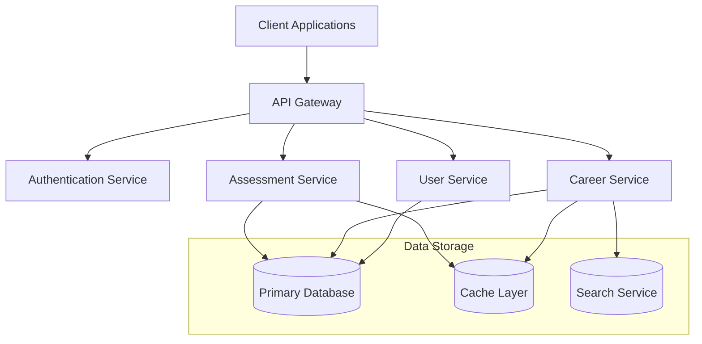
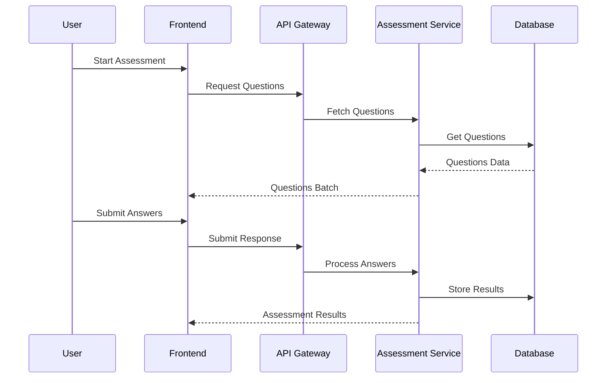
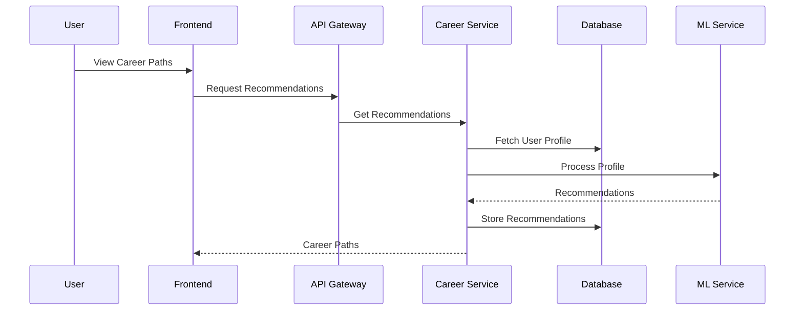
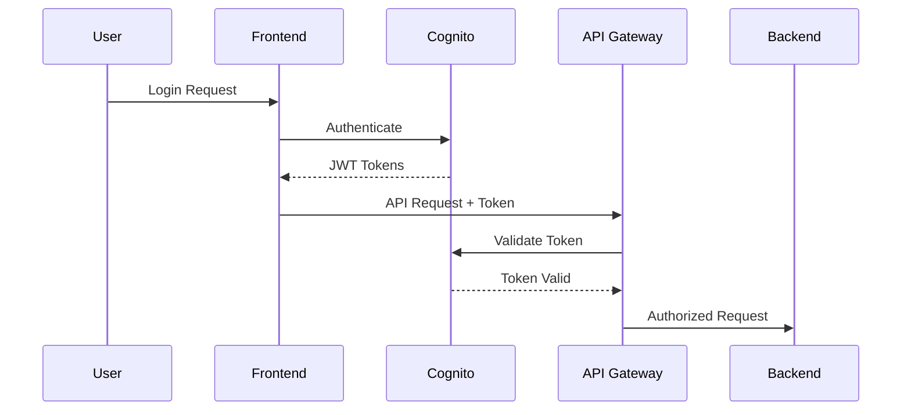
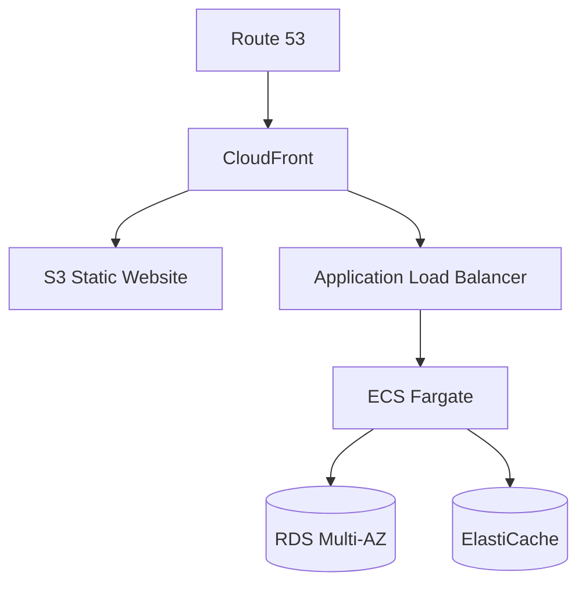
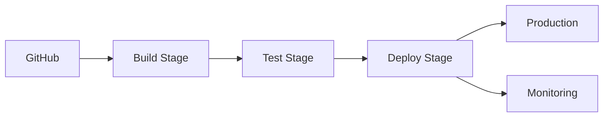

# Career Management System Technical Documentation

## System Architecture Overview

### 1. High-Level Architecture

The system follows a cloud-native, microservices-based architecture deployed on AWS, consisting of:

#### 1.1 Frontend Layer
- **Web Application**: React.js based SPA
- **Mobile Application**: Flutter-based cross-platform app
- **Admin Dashboard**: React.js with protected routes

#### 1.2 Backend Layer
- **API Gateway**: AWS API Gateway
- **Microservices**: AWS Lambda functions
- **Authentication**: Amazon Cognito
- **Business Logic Layer**: Serverless functions

#### 1.3 Data Layer
- **Primary Database**: Amazon RDS (PostgreSQL)
- **Cache Layer**: Amazon ElastiCache
- **File Storage**: Amazon S3
- **Search Engine**: Amazon OpenSearch

### 2. Detailed Component Architecture



## Data Flow Architecture

### 1. User Assessment Flow



### 2. Career Recommendation Flow



## Database Schema

### 1. Core Tables

#### 1.1 users
```sql
CREATE TABLE users (
    id UUID PRIMARY KEY,
    email VARCHAR(255) UNIQUE NOT NULL,
    full_name VARCHAR(255) NOT NULL,
    created_at TIMESTAMP DEFAULT CURRENT_TIMESTAMP,
    updated_at TIMESTAMP DEFAULT CURRENT_TIMESTAMP,
    metadata JSONB
);
```

#### 1.2 assessments
```sql
CREATE TABLE assessments (
    id UUID PRIMARY KEY,
    user_id UUID REFERENCES users(id),
    test_type VARCHAR(50) NOT NULL,
    results JSONB,
    started_at TIMESTAMP,
    completed_at TIMESTAMP,
    metadata JSONB
);
```

#### 1.3 career_paths
```sql
CREATE TABLE career_paths (
    id UUID PRIMARY KEY,
    title VARCHAR(255) NOT NULL,
    description TEXT,
    requirements JSONB,
    local_context JSONB,
    global_context JSONB,
    metadata JSONB
);
```

## API Documentation

### 1. Assessment API

#### 1.1 Start Assessment
```javascript
POST /api/v1/assessments/start
Content-Type: application/json

Request:
{
    "user_id": "uuid",
    "test_type": "MBTI|DISC",
    "preferences": {
        "language": "en|bn",
        "focus_areas": ["tech", "business"]
    }
}

Response:
{
    "assessment_id": "uuid",
    "questions": [...],
    "metadata": {...}
}
```

#### 1.2 Submit Answers
```javascript
POST /api/v1/assessments/{assessment_id}/submit
Content-Type: application/json

Request:
{
    "answers": [
        {
            "question_id": "uuid",
            "selected_option": "value",
            "timestamp": "iso8601"
        }
    ]
}

Response:
{
    "results": {
        "personality_type": "INTJ",
        "scores": {...},
        "recommendations": [...]
    }
}
```

## Security Implementation

### 1. Authentication Flow



### 2. Security Measures

- JWT-based authentication
- Role-based access control (RBAC)
- Request rate limiting
- Input validation
- SQL injection prevention
- XSS protection
- CORS configuration

## Deployment Architecture

### 1. AWS Infrastructure



### 2. CI/CD Pipeline



## Monitoring and Logging

### 1. Monitoring Stack
- CloudWatch Metrics
- CloudWatch Alarms
- X-Ray Tracing
- Custom Dashboards

### 2. Logging Strategy
- Centralized logging with CloudWatch Logs
- Log retention policies
- Error tracking
- Performance monitoring

## Scaling Strategy

### 1. Horizontal Scaling
- Auto-scaling groups for compute resources
- Read replicas for database
- Cache scaling

### 2. Performance Optimization
- Content delivery network
- Database query optimization
- Caching strategy
- Asset optimization

## Error Handling

### 1. Error Categories
- Validation errors
- Business logic errors
- System errors
- Network errors

### 2. Error Response Format
```javascript
{
    "error": {
        "code": "ERROR_CODE",
        "message": "User-friendly message",
        "details": {...},
        "timestamp": "iso8601",
        "request_id": "uuid"
    }
}
```

## Development Guidelines

### 1. Code Structure
```
src/
├── components/
│   ├── assessment/
│   ├── career/
│   └── common/
├── services/
│   ├── api/
│   ├── auth/
│   └── utils/
├── hooks/
├── contexts/
└── pages/
```

### 2. Coding Standards
- ESLint configuration
- Prettier setup
- Git commit conventions
- Code review guidelines

## API Rate Limiting

### 1. Tier-based Limits
```javascript
{
    "free_tier": {
        "requests_per_second": 10,
        "burst": 20
    },
    "premium_tier": {
        "requests_per_second": 50,
        "burst": 100
    }
}
```

## Data Backup Strategy

### 1. Backup Schedule
- Daily automated backups
- Weekly full backups
- Monthly archival
- Point-in-time recovery

### 2. Retention Policy
- 7 days for daily backups
- 30 days for weekly backups
- 1 year for monthly archives

## Disaster Recovery Plan

### 1. Recovery Time Objective (RTO)
- Critical systems: 1 hour
- Non-critical systems: 4 hours

### 2. Recovery Point Objective (RPO)
- Database: 5 minutes
- File storage: 1 hour

## Performance Benchmarks

### 1. Response Time Targets
- API responses: < 200ms
- Page load: < 2s
- Database queries: < 100ms

### 2. Availability Targets
- System uptime: 99.9%
- API availability: 99.95%
- Database availability: 99.99%


1. System Architecture:
- High-level architecture
- Component details
- Service interactions
- Data flow patterns

2. Data Flow:
- User assessment process
- Career recommendation engine
- Authentication flows
- Error handling

3. Deployment:
- AWS infrastructure setup
- Security implementation
- Scaling strategy
- Monitoring and logging

4. Development Guidelines:
- Code structure
- API documentation
- Error handling
- Performance benchmarks

# Career Management System API Documentation

## API Overview
Base URL: `https://api.careermanagement.com/v1`
Authentication: Bearer Token (JWT)

## Authentication Endpoints

### 1. User Registration
```http
POST /auth/register
Content-Type: application/json
```

#### Request Body
```json
{
    "email": "string",
    "password": "string",
    "full_name": "string",
    "university": "string",
    "student_id": "string",
    "preferences": {
        "language": "en|bn",
        "notifications_enabled": boolean
    }
}
```

#### Response (201 Created)
```json
{
    "user_id": "uuid",
    "access_token": "string",
    "refresh_token": "string",
    "expires_in": 3600
}
```

### 2. User Login
```http
POST /auth/login
Content-Type: application/json
```

#### Request Body
```json
{
    "email": "string",
    "password": "string"
}
```

#### Response (200 OK)
```json
{
    "access_token": "string",
    "refresh_token": "string",
    "expires_in": 3600,
    "user": {
        "id": "uuid",
        "email": "string",
        "full_name": "string",
        "last_login": "timestamp"
    }
}
```

## Assessment Endpoints

### 1. Start New Assessment
```http
POST /assessments/start
Authorization: Bearer {token}
Content-Type: application/json
```

#### Request Body
```json
{
    "test_type": "MBTI|DISC|HIGH5|OCEAN",
    "language": "en|bn",
    "preferences": {
        "career_focus": ["tech", "business", "creative"],
        "include_cultural_context": boolean
    }
}
```

#### Response (200 OK)
```json
{
    "assessment_id": "uuid",
    "questions": [
        {
            "id": "uuid",
            "question_text": "string",
            "question_type": "MULTIPLE_CHOICE|LIKERT_SCALE",
            "options": [
                {
                    "id": "uuid",
                    "text": "string",
                    "value": "string"
                }
            ],
            "order": number
        }
    ],
    "total_questions": number,
    "estimated_time_minutes": number
}
```

### 2. Submit Assessment Response
```http
POST /assessments/{assessment_id}/responses
Authorization: Bearer {token}
Content-Type: application/json
```

#### Request Body
```json
{
    "responses": [
        {
            "question_id": "uuid",
            "selected_option_id": "uuid",
            "time_spent_seconds": number
        }
    ]
}
```

#### Response (200 OK)
```json
{
    "status": "COMPLETED|PARTIAL",
    "completion_percentage": number,
    "next_question_id": "uuid|null"
}
```

### 3. Get Assessment Results
```http
GET /assessments/{assessment_id}/results
Authorization: Bearer {token}
```

#### Response (200 OK)
```json
{
    "assessment_id": "uuid",
    "personality_type": "string",
    "detailed_results": {
        "primary_traits": [
            {
                "trait": "string",
                "score": number,
                "description": "string"
            }
        ],
        "career_matches": [
            {
                "career_path": "string",
                "match_percentage": number,
                "required_skills": ["string"],
                "growth_potential": "HIGH|MEDIUM|LOW"
            }
        ],
        "skill_gaps": [
            {
                "skill": "string",
                "current_level": number,
                "required_level": number,
                "development_resources": [
                    {
                        "resource_type": "COURSE|CERTIFICATION|WORKSHOP",
                        "title": "string",
                        "provider": "string",
                        "url": "string",
                        "cost": {
                            "amount": number,
                            "currency": "string"
                        }
                    }
                ]
            }
        ]
    }
}
```

## Career Path Endpoints

### 1. Get Career Recommendations
```http
GET /careers/recommendations
Authorization: Bearer {token}
Query Parameters:
    - personality_type: string
    - location: string (optional)
    - industry: string (optional)
    - experience_level: string (optional)
```

#### Response (200 OK)
```json
{
    "recommendations": [
        {
            "career_path": {
                "id": "uuid",
                "title": "string",
                "description": "string",
                "match_score": number,
                "salary_range": {
                    "min": number,
                    "max": number,
                    "currency": "string"
                },
                "required_skills": ["string"],
                "education_requirements": ["string"]
            },
            "local_opportunities": [
                {
                    "company": "string",
                    "position": "string",
                    "location": "string",
                    "salary_range": {
                        "min": number,
                        "max": number,
                        "currency": "BDT"
                    },
                    "application_url": "string"
                }
            ],
            "global_opportunities": [
                {
                    "country": "string",
                    "average_salary": {
                        "amount": number,
                        "currency": "string"
                    },
                    "visa_requirements": "string",
                    "job_boards": ["string"]
                }
            ]
        }
    ]
}
```

### 2. Get Skill Development Path
```http
GET /careers/{career_path_id}/skill-path
Authorization: Bearer {token}
```

#### Response (200 OK)
```json
{
    "career_path": "string",
    "required_skills": [
        {
            "skill": "string",
            "importance": "ESSENTIAL|PREFERRED",
            "development_path": [
                {
                    "level": "BEGINNER|INTERMEDIATE|ADVANCED",
                    "resources": [
                        {
                            "type": "COURSE|CERTIFICATION|WORKSHOP",
                            "title": "string",
                            "provider": "string",
                            "duration": "string",
                            "cost": {
                                "amount": number,
                                "currency": "string"
                            },
                            "location": "ONLINE|OFFLINE",
                            "schedule": {
                                "start_date": "date",
                                "end_date": "date",
                                "schedule_type": "SELF_PACED|SCHEDULED"
                            }
                        }
                    ]
                }
            ]
        }
    ]
}
```

## Profile Management Endpoints

### 1. Update User Profile
```http
PUT /users/profile
Authorization: Bearer {token}
Content-Type: application/json
```

#### Request Body
```json
{
    "full_name": "string",
    "education": {
        "university": "string",
        "degree": "string",
        "graduation_year": number
    },
    "skills": [
        {
            "skill": "string",
            "proficiency": "BEGINNER|INTERMEDIATE|ADVANCED",
            "years_experience": number
        }
    ],
    "preferences": {
        "preferred_industries": ["string"],
        "preferred_locations": ["string"],
        "salary_expectation": {
            "amount": number,
            "currency": "string"
        }
    }
}
```

### 2. Get Progress Tracking
```http
GET /users/progress
Authorization: Bearer {token}
```

#### Response (200 OK)
```json
{
    "assessments_completed": [
        {
            "test_type": "string",
            "completion_date": "timestamp",
            "results_summary": "string"
        }
    ],
    "skills_progress": [
        {
            "skill": "string",
            "initial_level": "string",
            "current_level": "string",
            "target_level": "string",
            "progress_percentage": number
        }
    ],
    "career_goals": [
        {
            "goal": "string",
            "status": "IN_PROGRESS|COMPLETED",
            "target_date": "date",
            "progress_percentage": number
        }
    ]
}
```

## Error Responses

### 1. Validation Error (400 Bad Request)
```json
{
    "error": {
        "code": "VALIDATION_ERROR",
        "message": "Invalid input parameters",
        "details": {
            "field": ["error message"]
        }
    }
}
```

### 2. Authentication Error (401 Unauthorized)
```json
{
    "error": {
        "code": "AUTHENTICATION_ERROR",
        "message": "Invalid or expired token"
    }
}
```

### 3. Resource Not Found (404 Not Found)
```json
{
    "error": {
        "code": "RESOURCE_NOT_FOUND",
        "message": "The requested resource was not found",
        "resource_type": "string"
    }
}
```

## Rate Limiting

- Free Tier: 100 requests per minute
- Premium Tier: 1000 requests per minute

Rate limit headers included in all responses:
```http
X-RateLimit-Limit: number
X-RateLimit-Remaining: number
X-RateLimit-Reset: timestamp
```

## User Journey Sequence

sequenceDiagram
    participant U as User
    participant F as Frontend
    participant AG as API Gateway
    participant AS as Auth Service
    participant PS as Profile Service
    participant TS as Test Service
    participant CS as Career Service
    participant DB as Database
    participant ML as ML Service

    %% User Registration and Initial Assessment
    U->>F: Register Account
    F->>AG: POST /auth/register
    AG->>AS: Create User
    AS->>DB: Store User Data
    DB-->>AS: Confirm Storage
    AS-->>F: Return JWT Token
    
    U->>F: Start Assessment
    F->>AG: POST /assessments/start
    AG->>TS: Initialize Test
    TS->>DB: Create Assessment Record
    DB-->>TS: Confirm Creation
    TS-->>F: Return Questions Batch
    
    U->>F: Submit Answers
    F->>AG: POST /assessment/responses
    AG->>TS: Process Responses
    TS->>ML: Analyze Responses
    ML->>DB: Store Results
    DB-->>ML: Confirm Storage
    ML-->>TS: Return Analysis
    TS-->>F: Return Results
    
    %% Career Recommendations
    U->>F: View Career Paths
    F->>AG: GET /careers/recommendations
    AG->>CS: Get Recommendations
    CS->>DB: Fetch User Profile
    DB-->>CS: Return Profile
    CS->>ML: Generate Recommendations
    ML-->>CS: Return Matches
    CS-->>F: Return Career Paths
    
    %% Skill Development
    U->>F: View Skill Path
    F->>AG: GET /careers/skill-path
    AG->>CS: Get Skill Requirements
    CS->>DB: Fetch Current Skills
    DB-->>CS: Return Skills
    CS->>ML: Analyze Skill Gaps
    ML-->>CS: Return Development Path
    CS-->>F: Return Skill Plan


## Career Development Journey Sequence

sequenceDiagram
    participant U as User
    participant F as Frontend
    participant AG as API Gateway
    participant AS as Auth Service
    participant PS as Profile Service
    participant TS as Test Service
    participant CS as Career Service
    participant DB as Database
    participant ML as ML Service

    %% User Registration and Initial Assessment
    U->>F: Register Account
    F->>AG: POST /auth/register
    AG->>AS: Create User
    AS->>DB: Store User Data
    DB-->>AS: Confirm Storage
    AS-->>F: Return JWT Token
    
    U->>F: Start Assessment
    F->>AG: POST /assessments/start
    AG->>TS: Initialize Test
    TS->>DB: Create Assessment Record
    DB-->>TS: Confirm Creation
    TS-->>F: Return Questions Batch
    
    U->>F: Submit Answers
    F->>AG: POST /assessment/responses
    AG->>TS: Process Responses
    TS->>ML: Analyze Responses
    ML->>DB: Store Results
    DB-->>ML: Confirm Storage
    ML-->>TS: Return Analysis
    TS-->>F: Return Results
    
    %% Career Recommendations
    U->>F: View Career Paths
    F->>AG: GET /careers/recommendations
    AG->>CS: Get Recommendations
    CS->>DB: Fetch User Profile
    DB-->>CS: Return Profile
    CS->>ML: Generate Recommendations
    ML-->>CS: Return Matches
    CS-->>F: Return Career Paths
    
    %% Skill Development
    U->>F: View Skill Path
    F->>AG: GET /careers/skill-path
    AG->>CS: Get Skill Requirements
    CS->>DB: Fetch Current Skills
    DB-->>CS: Return Skills
    CS->>ML: Analyze Skill Gaps
    ML-->>CS: Return Development Path
    CS-->>F: Return Skill Plan
