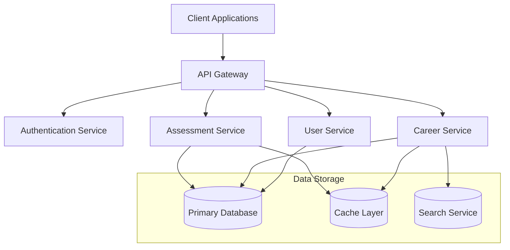
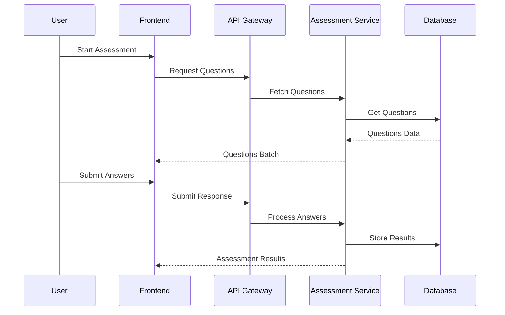
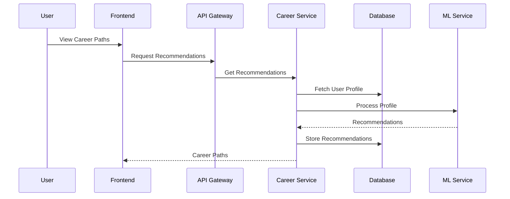
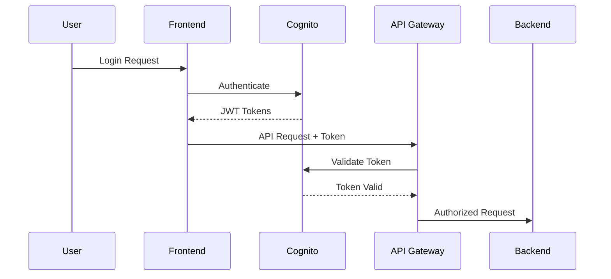
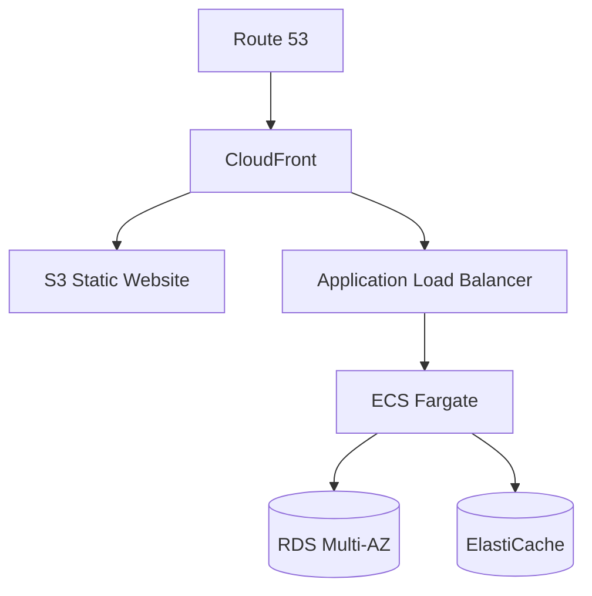
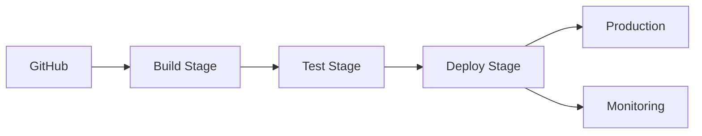

# Career Personality Test

Building an application that provides users with their MBTI personality type, a SWOT analysis, and career guidance, all wrapped in a slick user interface, is an ambitious and rewarding project. Below is a comprehensive guide to help you navigate through the process, from planning to deployment.

1. Project Overview

Objective:
Create a web or mobile application that:
	•	Assesses users’ MBTI personality types.
	•	Generates a SWOT (Strengths, Weaknesses, Opportunities, Threats) analysis based on the MBTI results.
	•	Provides personalized career guidance.
	•	Features a modern, intuitive, and visually appealing user interface.

2. Core Features

a. MBTI Assessment
	•	Questionnaire: Design a series of questions to determine the user’s MBTI type.
	•	Scoring Logic: Implement algorithms to analyze responses and assign one of the 16 MBTI types.
	•	Results Display: Present the MBTI type with detailed descriptions.

b. SWOT Analysis
	•	Automated Generation: Based on the MBTI type, generate a personalized SWOT analysis.
	•	Strengths & Weaknesses: Derived from inherent traits of the MBTI type.
	•	Opportunities & Threats: Consider external factors like job market trends relevant to the personality.

c. Career Guidance
	•	Career Suggestions: Provide a list of suitable careers tailored to the MBTI type.
	•	Actionable Insights: Offer advice on how to leverage strengths and address weaknesses in career development.
	•	Resources: Link to articles, courses, or certifications relevant to suggested career paths.

d. User Account Management
	•	Registration/Login: Allow users to create accounts to save their results and track progress.
	•	Profile Management: Let users update personal information and revisit assessments.

e. Analytics Dashboard (Optional)
	•	User Insights: Aggregate anonymized data to understand user demographics and popular MBTI types.
	•	Engagement Metrics: Track user interactions to improve the app continuously.

3. Technology Stack

a. Frontend
	•	Frameworks/Libraries:
	•	Web: React.js, Vue.js, or Angular for dynamic and responsive interfaces.
	•	Mobile: React Native or Flutter for cross-platform mobile applications.
	•	UI Libraries: Material-UI, Ant Design, or Tailwind CSS for sleek and consistent styling.
	•	State Management: Redux or Vuex for managing application state efficiently.

b. Backend
	•	Frameworks:
	•	Node.js with Express.js
	•	Django (Python)
	•	Ruby on Rails
	•	Database:
	•	Relational: PostgreSQL or MySQL for structured data.
	•	NoSQL: MongoDB for flexibility if needed.
	•	Authentication: JWT (JSON Web Tokens) or OAuth for secure user authentication.

c. Additional Tools
	•	APIs: RESTful or GraphQL APIs for frontend-backend communication.
	•	Deployment:
	•	Web: Vercel, Netlify, or AWS Amplify.
	•	Mobile: Apple App Store and Google Play Store.
	•	Version Control: Git with GitHub or GitLab.
	•	CI/CD: GitHub Actions, Travis CI, or Jenkins for continuous integration and deployment.

4. UI/UX Design

a. Design Principles
	•	Simplicity: Keep interfaces clean and uncluttered to enhance user experience.
	•	Consistency: Use consistent color schemes, typography, and component styles.
	•	Responsiveness: Ensure the application is fully responsive across devices and screen sizes.
	•	Accessibility: Adhere to accessibility standards (WCAG) to make the app usable for everyone.

b. Design Tools
	•	Wireframing & Prototyping: Figma, Adobe XD, or Sketch for designing and prototyping the UI.
	•	Asset Design: Canva or Adobe Illustrator for creating custom graphics and icons.

c. Slick UI Elements
	•	Animations: Incorporate subtle animations and transitions to make interactions feel smooth.
	•	Interactive Elements: Use tooltips, modals, and interactive charts for dynamic data presentation.
	•	Dark Mode: Offer theme toggling for user preference and better visual appeal.

5. Implementation Steps

a. Planning
	1.	Define Requirements: Clearly outline all features and functionalities.
	2.	Create User Stories: Understand the user journey and define how users will interact with the app.
	3.	Design Mockups: Develop wireframes and prototypes to visualize the UI/UX.

b. Development
	1.	Set Up the Development Environment: Configure necessary tools, frameworks, and repositories.
	2.	Build the Frontend: Develop the user interface based on the designs.
	3.	Develop the Backend: Implement APIs, database schemas, and business logic.
	4.	Integrate Frontend and Backend: Ensure seamless communication between the client and server.

c. Testing
	1.	Unit Testing: Test individual components and functions.
	2.	Integration Testing: Ensure different parts of the application work together correctly.
	3.	User Acceptance Testing (UAT): Gather feedback from real users and make necessary adjustments.

d. Deployment
	1.	Choose Hosting Services: Deploy the backend on platforms like AWS, Heroku, or DigitalOcean. Frontend can be hosted on Vercel, Netlify, etc.
	2.	Set Up CI/CD Pipelines: Automate the deployment process for efficiency.
	3.	Monitor Performance: Use tools like Google Analytics, Sentry, or New Relic to monitor app performance and errors.

e. Maintenance and Updates
	•	Regular Updates: Keep the app updated with new features and improvements based on user feedback.
	•	Bug Fixes: Address any issues promptly to maintain a smooth user experience.
	•	Security: Continuously monitor and enhance the app’s security measures.

6. Developing the MBTI and SWOT Logic

a. MBTI Assessment
	•	Questionnaire Design: Typically 60-100 questions covering the four dichotomies:
	•	Extraversion (E) vs. Introversion (I)
	•	Sensing (S) vs. Intuition (N)
	•	Thinking (T) vs. Feeling (F)
	•	Judging (J) vs. Perceiving (P)
	•	Scoring Mechanism: Assign points based on user responses to determine each dimension’s leaning.
	•	Result Interpretation: Map the scores to one of the 16 MBTI types with comprehensive descriptions.

b. SWOT Analysis Generation
	•	Strengths & Weaknesses: Derive from the inherent traits of each MBTI type. For example:
	•	ENTJ Strengths: Leadership, strategic thinking.
	•	ENTJ Weaknesses: Impatience, overconfidence.
	•	Opportunities & Threats: Analyze external factors such as:
	•	Opportunities: Career fields that align well with the MBTI type.
	•	Threats: Potential challenges in the job market or personal growth areas.

c. Career Guidance Logic
	•	Career Matching: Create a database mapping MBTI types to suitable careers based on industry research.
	•	Personalized Advice: Offer tips on how to utilize strengths and mitigate weaknesses in career paths.
	•	Resource Linking: Provide links to further reading, courses, or job listings relevant to the suggested careers.

7. Best Practices and Considerations

a. Data Privacy and Security
	•	User Data Protection: Implement encryption, secure authentication, and follow data protection regulations (e.g., GDPR).
	•	Privacy Policy: Clearly communicate how user data is collected, used, and stored.

b. Scalability
	•	Modular Architecture: Design the application to handle increasing user loads without significant rework.
	•	Efficient Database Design: Optimize database queries and indexing for performance.

c. Performance Optimization
	•	Lazy Loading: Load components and data as needed to improve initial load times.
	•	Caching: Implement caching strategies for frequently accessed data.
	•	Minification: Minify CSS, JavaScript, and images to reduce load times.

d. User Feedback Integration
	•	Feedback Mechanisms: Incorporate ways for users to provide feedback within the app.
	•	Iterative Development: Use feedback to make continuous improvements and add features that users want.

8. Additional Tips
	•	Research and Validation: Ensure that the MBTI assessment is scientifically sound. Consider consulting psychological experts.
	•	Competitive Analysis: Analyze similar platforms like 16personalities.com to identify strengths and areas for improvement in your app.
	•	Marketing Strategy: Plan how to attract and retain users through SEO, social media, content marketing, and possibly partnerships.
	•	Monetization: If applicable, decide on monetization strategies such as premium features, ads, or subscriptions.

9. Resources and References
	•	MBTI Resources:
	•	Official MBTI Website
	•	MBTI Books by Isabel Briggs Myers
	•	Development Tutorials:
	•	React Documentation
	•	Node.js and Express.js Guide
	•	Django Official Tutorial
	•	UI/UX Design:
	•	Figma Tutorials
	•	Material Design Guidelines
	•	Deployment Guides:
	•	Deploying with Vercel
	•	Heroku Deployment

Conclusion

Creating an application that integrates MBTI assessments with SWOT analysis and career guidance is a multifaceted project that combines psychological insights with robust software development practices. By carefully planning your features, choosing the right technology stack, focusing on a slick and user-friendly UI, and adhering to best practices in development and security, you can build a valuable tool that helps users understand themselves better and make informed career decisions.


# Career Management System Technical Documentation

## System Architecture Overview

### 1. High-Level Architecture

The system follows a cloud-native, microservices-based architecture deployed on AWS, consisting of:

#### 1.1 Frontend Layer
- **Web Application**: React.js based SPA
- **Mobile Application**: Flutter-based cross-platform app
- **Admin Dashboard**: React.js with protected routes

#### 1.2 Backend Layer
- **API Gateway**: AWS API Gateway
- **Microservices**: AWS Lambda functions
- **Authentication**: Amazon Cognito
- **Business Logic Layer**: Serverless functions

#### 1.3 Data Layer
- **Primary Database**: Amazon RDS (PostgreSQL)
- **Cache Layer**: Amazon ElastiCache
- **File Storage**: Amazon S3
- **Search Engine**: Amazon OpenSearch

### 2. Detailed Component Architecture


```mermaid
graph TB
    Client[Client Applications] --> AGW[API Gateway]
    AGW --> Auth[Authentication Service]
    AGW --> AS[Assessment Service]
    AGW --> CS[Career Service]
    AGW --> US[User Service]
    
    AS --> DB[(Primary Database)]
    CS --> DB
    US --> DB
    
    AS --> Cache[(Cache Layer)]
    CS --> Cache
    
    CS --> Search[(Search Service)]
    
    subgraph Data Storage
        DB
        Cache
        Search
    end
```

## Data Flow Architecture

### 1. User Assessment Flow


```mermaid
sequenceDiagram
    participant User
    participant Frontend
    participant API Gateway
    participant Assessment Service
    participant Database
    
    User->>Frontend: Start Assessment
    Frontend->>API Gateway: Request Questions
    API Gateway->>Assessment Service: Fetch Questions
    Assessment Service->>Database: Get Questions
    Database-->>Assessment Service: Questions Data
    Assessment Service-->>Frontend: Questions Batch
    
    User->>Frontend: Submit Answers
    Frontend->>API Gateway: Submit Response
    API Gateway->>Assessment Service: Process Answers
    Assessment Service->>Database: Store Results
    Assessment Service-->>Frontend: Assessment Results
```

### 2. Career Recommendation Flow


```mermaid
sequenceDiagram
    participant User
    participant Frontend
    participant API Gateway
    participant Career Service
    participant Database
    participant ML Service
    
    User->>Frontend: View Career Paths
    Frontend->>API Gateway: Request Recommendations
    API Gateway->>Career Service: Get Recommendations
    Career Service->>Database: Fetch User Profile
    Career Service->>ML Service: Process Profile
    ML Service-->>Career Service: Recommendations
    Career Service->>Database: Store Recommendations
    Career Service-->>Frontend: Career Paths
```

## Database Schema

### 1. Core Tables

#### 1.1 users
```sql
CREATE TABLE users (
    id UUID PRIMARY KEY,
    email VARCHAR(255) UNIQUE NOT NULL,
    full_name VARCHAR(255) NOT NULL,
    created_at TIMESTAMP DEFAULT CURRENT_TIMESTAMP,
    updated_at TIMESTAMP DEFAULT CURRENT_TIMESTAMP,
    metadata JSONB
);
```

#### 1.2 assessments
```sql
CREATE TABLE assessments (
    id UUID PRIMARY KEY,
    user_id UUID REFERENCES users(id),
    test_type VARCHAR(50) NOT NULL,
    results JSONB,
    started_at TIMESTAMP,
    completed_at TIMESTAMP,
    metadata JSONB
);
```

#### 1.3 career_paths
```sql
CREATE TABLE career_paths (
    id UUID PRIMARY KEY,
    title VARCHAR(255) NOT NULL,
    description TEXT,
    requirements JSONB,
    local_context JSONB,
    global_context JSONB,
    metadata JSONB
);
```

## API Documentation

### 1. Assessment API

#### 1.1 Start Assessment
```javascript
POST /api/v1/assessments/start
Content-Type: application/json

Request:
{
    "user_id": "uuid",
    "test_type": "MBTI|DISC",
    "preferences": {
        "language": "en|bn",
        "focus_areas": ["tech", "business"]
    }
}

Response:
{
    "assessment_id": "uuid",
    "questions": [...],
    "metadata": {...}
}
```

#### 1.2 Submit Answers
```javascript
POST /api/v1/assessments/{assessment_id}/submit
Content-Type: application/json

Request:
{
    "answers": [
        {
            "question_id": "uuid",
            "selected_option": "value",
            "timestamp": "iso8601"
        }
    ]
}

Response:
{
    "results": {
        "personality_type": "INTJ",
        "scores": {...},
        "recommendations": [...]
    }
}
```

## Security Implementation

### 1. Authentication Flow


```mermaid
sequenceDiagram
    participant User
    participant Frontend
    participant Cognito
    participant API Gateway
    
    User->>Frontend: Login Request
    Frontend->>Cognito: Authenticate
    Cognito-->>Frontend: JWT Tokens
    Frontend->>API Gateway: API Request + Token
    API Gateway->>Cognito: Validate Token
    Cognito-->>API Gateway: Token Valid
    API Gateway->>Backend: Authorized Request
```

### 2. Security Measures

- JWT-based authentication
- Role-based access control (RBAC)
- Request rate limiting
- Input validation
- SQL injection prevention
- XSS protection
- CORS configuration

## Deployment Architecture

### 1. AWS Infrastructure


```mermaid
graph TB
    Route53[Route 53] --> CloudFront
    CloudFront --> S3[S3 Static Website]
    CloudFront --> ALB[Application Load Balancer]
    ALB --> ECS[ECS Fargate]
    ECS --> RDS[(RDS Multi-AZ)]
    ECS --> Cache[(ElastiCache)]
```

### 2. CI/CD Pipeline


```mermaid
graph LR
    Git[GitHub] --> Build[Build Stage]
    Build --> Test[Test Stage]
    Test --> Deploy[Deploy Stage]
    Deploy --> Prod[Production]
    Deploy --> Monitor[Monitoring]
```

## Monitoring and Logging

### 1. Monitoring Stack
- CloudWatch Metrics
- CloudWatch Alarms
- X-Ray Tracing
- Custom Dashboards

### 2. Logging Strategy
- Centralized logging with CloudWatch Logs
- Log retention policies
- Error tracking
- Performance monitoring

## Scaling Strategy

### 1. Horizontal Scaling
- Auto-scaling groups for compute resources
- Read replicas for database
- Cache scaling

### 2. Performance Optimization
- Content delivery network
- Database query optimization
- Caching strategy
- Asset optimization

## Error Handling

### 1. Error Categories
- Validation errors
- Business logic errors
- System errors
- Network errors

### 2. Error Response Format
```javascript
{
    "error": {
        "code": "ERROR_CODE",
        "message": "User-friendly message",
        "details": {...},
        "timestamp": "iso8601",
        "request_id": "uuid"
    }
}
```

## Development Guidelines

### 1. Code Structure
```
src/
├── components/
│   ├── assessment/
│   ├── career/
│   └── common/
├── services/
│   ├── api/
│   ├── auth/
│   └── utils/
├── hooks/
├── contexts/
└── pages/
```

### 2. Coding Standards
- ESLint configuration
- Prettier setup
- Git commit conventions
- Code review guidelines

## API Rate Limiting

### 1. Tier-based Limits
```javascript
{
    "free_tier": {
        "requests_per_second": 10,
        "burst": 20
    },
    "premium_tier": {
        "requests_per_second": 50,
        "burst": 100
    }
}
```

## Data Backup Strategy

### 1. Backup Schedule
- Daily automated backups
- Weekly full backups
- Monthly archival
- Point-in-time recovery

### 2. Retention Policy
- 7 days for daily backups
- 30 days for weekly backups
- 1 year for monthly archives

## Disaster Recovery Plan

### 1. Recovery Time Objective (RTO)
- Critical systems: 1 hour
- Non-critical systems: 4 hours

### 2. Recovery Point Objective (RPO)
- Database: 5 minutes
- File storage: 1 hour

## Performance Benchmarks

### 1. Response Time Targets
- API responses: < 200ms
- Page load: < 2s
- Database queries: < 100ms

### 2. Availability Targets
- System uptime: 99.9%
- API availability: 99.95%
- Database availability: 99.99%


1. System Architecture:
- High-level architecture
- Component details
- Service interactions
- Data flow patterns

2. Data Flow:
- User assessment process
- Career recommendation engine
- Authentication flows
- Error handling

3. Deployment:
- AWS infrastructure setup
- Security implementation
- Scaling strategy
- Monitoring and logging

4. Development Guidelines:
- Code structure
- API documentation
- Error handling
- Performance benchmarks

# Career Management System API Documentation

## API Overview
Base URL: `https://api.careermanagement.com/v1`
Authentication: Bearer Token (JWT)

## Authentication Endpoints

### 1. User Registration
```http
POST /auth/register
Content-Type: application/json
```

#### Request Body
```json
{
    "email": "string",
    "password": "string",
    "full_name": "string",
    "university": "string",
    "student_id": "string",
    "preferences": {
        "language": "en|bn",
        "notifications_enabled": boolean
    }
}
```

#### Response (201 Created)
```json
{
    "user_id": "uuid",
    "access_token": "string",
    "refresh_token": "string",
    "expires_in": 3600
}
```

### 2. User Login
```http
POST /auth/login
Content-Type: application/json
```

#### Request Body
```json
{
    "email": "string",
    "password": "string"
}
```

#### Response (200 OK)
```json
{
    "access_token": "string",
    "refresh_token": "string",
    "expires_in": 3600,
    "user": {
        "id": "uuid",
        "email": "string",
        "full_name": "string",
        "last_login": "timestamp"
    }
}
```

## Assessment Endpoints

### 1. Start New Assessment
```http
POST /assessments/start
Authorization: Bearer {token}
Content-Type: application/json
```

#### Request Body
```json
{
    "test_type": "MBTI|DISC|HIGH5|OCEAN",
    "language": "en|bn",
    "preferences": {
        "career_focus": ["tech", "business", "creative"],
        "include_cultural_context": boolean
    }
}
```

#### Response (200 OK)
```json
{
    "assessment_id": "uuid",
    "questions": [
        {
            "id": "uuid",
            "question_text": "string",
            "question_type": "MULTIPLE_CHOICE|LIKERT_SCALE",
            "options": [
                {
                    "id": "uuid",
                    "text": "string",
                    "value": "string"
                }
            ],
            "order": number
        }
    ],
    "total_questions": number,
    "estimated_time_minutes": number
}
```

### 2. Submit Assessment Response
```http
POST /assessments/{assessment_id}/responses
Authorization: Bearer {token}
Content-Type: application/json
```

#### Request Body
```json
{
    "responses": [
        {
            "question_id": "uuid",
            "selected_option_id": "uuid",
            "time_spent_seconds": number
        }
    ]
}
```

#### Response (200 OK)
```json
{
    "status": "COMPLETED|PARTIAL",
    "completion_percentage": number,
    "next_question_id": "uuid|null"
}
```

### 3. Get Assessment Results
```http
GET /assessments/{assessment_id}/results
Authorization: Bearer {token}
```

#### Response (200 OK)
```json
{
    "assessment_id": "uuid",
    "personality_type": "string",
    "detailed_results": {
        "primary_traits": [
            {
                "trait": "string",
                "score": number,
                "description": "string"
            }
        ],
        "career_matches": [
            {
                "career_path": "string",
                "match_percentage": number,
                "required_skills": ["string"],
                "growth_potential": "HIGH|MEDIUM|LOW"
            }
        ],
        "skill_gaps": [
            {
                "skill": "string",
                "current_level": number,
                "required_level": number,
                "development_resources": [
                    {
                        "resource_type": "COURSE|CERTIFICATION|WORKSHOP",
                        "title": "string",
                        "provider": "string",
                        "url": "string",
                        "cost": {
                            "amount": number,
                            "currency": "string"
                        }
                    }
                ]
            }
        ]
    }
}
```

## Career Path Endpoints

### 1. Get Career Recommendations
```http
GET /careers/recommendations
Authorization: Bearer {token}
Query Parameters:
    - personality_type: string
    - location: string (optional)
    - industry: string (optional)
    - experience_level: string (optional)
```

#### Response (200 OK)
```json
{
    "recommendations": [
        {
            "career_path": {
                "id": "uuid",
                "title": "string",
                "description": "string",
                "match_score": number,
                "salary_range": {
                    "min": number,
                    "max": number,
                    "currency": "string"
                },
                "required_skills": ["string"],
                "education_requirements": ["string"]
            },
            "local_opportunities": [
                {
                    "company": "string",
                    "position": "string",
                    "location": "string",
                    "salary_range": {
                        "min": number,
                        "max": number,
                        "currency": "BDT"
                    },
                    "application_url": "string"
                }
            ],
            "global_opportunities": [
                {
                    "country": "string",
                    "average_salary": {
                        "amount": number,
                        "currency": "string"
                    },
                    "visa_requirements": "string",
                    "job_boards": ["string"]
                }
            ]
        }
    ]
}
```

### 2. Get Skill Development Path
```http
GET /careers/{career_path_id}/skill-path
Authorization: Bearer {token}
```

#### Response (200 OK)
```json
{
    "career_path": "string",
    "required_skills": [
        {
            "skill": "string",
            "importance": "ESSENTIAL|PREFERRED",
            "development_path": [
                {
                    "level": "BEGINNER|INTERMEDIATE|ADVANCED",
                    "resources": [
                        {
                            "type": "COURSE|CERTIFICATION|WORKSHOP",
                            "title": "string",
                            "provider": "string",
                            "duration": "string",
                            "cost": {
                                "amount": number,
                                "currency": "string"
                            },
                            "location": "ONLINE|OFFLINE",
                            "schedule": {
                                "start_date": "date",
                                "end_date": "date",
                                "schedule_type": "SELF_PACED|SCHEDULED"
                            }
                        }
                    ]
                }
            ]
        }
    ]
}
```

## Profile Management Endpoints

### 1. Update User Profile
```http
PUT /users/profile
Authorization: Bearer {token}
Content-Type: application/json
```

#### Request Body
```json
{
    "full_name": "string",
    "education": {
        "university": "string",
        "degree": "string",
        "graduation_year": number
    },
    "skills": [
        {
            "skill": "string",
            "proficiency": "BEGINNER|INTERMEDIATE|ADVANCED",
            "years_experience": number
        }
    ],
    "preferences": {
        "preferred_industries": ["string"],
        "preferred_locations": ["string"],
        "salary_expectation": {
            "amount": number,
            "currency": "string"
        }
    }
}
```

### 2. Get Progress Tracking
```http
GET /users/progress
Authorization: Bearer {token}
```

#### Response (200 OK)
```json
{
    "assessments_completed": [
        {
            "test_type": "string",
            "completion_date": "timestamp",
            "results_summary": "string"
        }
    ],
    "skills_progress": [
        {
            "skill": "string",
            "initial_level": "string",
            "current_level": "string",
            "target_level": "string",
            "progress_percentage": number
        }
    ],
    "career_goals": [
        {
            "goal": "string",
            "status": "IN_PROGRESS|COMPLETED",
            "target_date": "date",
            "progress_percentage": number
        }
    ]
}
```

## Error Responses

### 1. Validation Error (400 Bad Request)
```json
{
    "error": {
        "code": "VALIDATION_ERROR",
        "message": "Invalid input parameters",
        "details": {
            "field": ["error message"]
        }
    }
}
```

### 2. Authentication Error (401 Unauthorized)
```json
{
    "error": {
        "code": "AUTHENTICATION_ERROR",
        "message": "Invalid or expired token"
    }
}
```

### 3. Resource Not Found (404 Not Found)
```json
{
    "error": {
        "code": "RESOURCE_NOT_FOUND",
        "message": "The requested resource was not found",
        "resource_type": "string"
    }
}
```

## Rate Limiting

- Free Tier: 100 requests per minute
- Premium Tier: 1000 requests per minute

Rate limit headers included in all responses:
```http
X-RateLimit-Limit: number
X-RateLimit-Remaining: number
X-RateLimit-Reset: timestamp
```

## User Journey Sequence

sequenceDiagram
    participant U as User
    participant F as Frontend
    participant AG as API Gateway
    participant AS as Auth Service
    participant PS as Profile Service
    participant TS as Test Service
    participant CS as Career Service
    participant DB as Database
    participant ML as ML Service

    %% User Registration and Initial Assessment
    U->>F: Register Account
    F->>AG: POST /auth/register
    AG->>AS: Create User
    AS->>DB: Store User Data
    DB-->>AS: Confirm Storage
    AS-->>F: Return JWT Token
    
    U->>F: Start Assessment
    F->>AG: POST /assessments/start
    AG->>TS: Initialize Test
    TS->>DB: Create Assessment Record
    DB-->>TS: Confirm Creation
    TS-->>F: Return Questions Batch
    
    U->>F: Submit Answers
    F->>AG: POST /assessment/responses
    AG->>TS: Process Responses
    TS->>ML: Analyze Responses
    ML->>DB: Store Results
    DB-->>ML: Confirm Storage
    ML-->>TS: Return Analysis
    TS-->>F: Return Results
    
    %% Career Recommendations
    U->>F: View Career Paths
    F->>AG: GET /careers/recommendations
    AG->>CS: Get Recommendations
    CS->>DB: Fetch User Profile
    DB-->>CS: Return Profile
    CS->>ML: Generate Recommendations
    ML-->>CS: Return Matches
    CS-->>F: Return Career Paths
    
    %% Skill Development
    U->>F: View Skill Path
    F->>AG: GET /careers/skill-path
    AG->>CS: Get Skill Requirements
    CS->>DB: Fetch Current Skills
    DB-->>CS: Return Skills
    CS->>ML: Analyze Skill Gaps
    ML-->>CS: Return Development Path
    CS-->>F: Return Skill Plan


## Career Development Journey Sequence

sequenceDiagram
    participant U as User
    participant F as Frontend
    participant AG as API Gateway
    participant AS as Auth Service
    participant PS as Profile Service
    participant TS as Test Service
    participant CS as Career Service
    participant DB as Database
    participant ML as ML Service

    %% User Registration and Initial Assessment
    U->>F: Register Account
    F->>AG: POST /auth/register
    AG->>AS: Create User
    AS->>DB: Store User Data
    DB-->>AS: Confirm Storage
    AS-->>F: Return JWT Token
    
    U->>F: Start Assessment
    F->>AG: POST /assessments/start
    AG->>TS: Initialize Test
    TS->>DB: Create Assessment Record
    DB-->>TS: Confirm Creation
    TS-->>F: Return Questions Batch
    
    U->>F: Submit Answers
    F->>AG: POST /assessment/responses
    AG->>TS: Process Responses
    TS->>ML: Analyze Responses
    ML->>DB: Store Results
    DB-->>ML: Confirm Storage
    ML-->>TS: Return Analysis
    TS-->>F: Return Results
    
    %% Career Recommendations
    U->>F: View Career Paths
    F->>AG: GET /careers/recommendations
    AG->>CS: Get Recommendations
    CS->>DB: Fetch User Profile
    DB-->>CS: Return Profile
    CS->>ML: Generate Recommendations
    ML-->>CS: Return Matches
    CS-->>F: Return Career Paths
    
    %% Skill Development
    U->>F: View Skill Path
    F->>AG: GET /careers/skill-path
    AG->>CS: Get Skill Requirements
    CS->>DB: Fetch Current Skills
    DB-->>CS: Return Skills
    CS->>ML: Analyze Skill Gaps
    ML-->>CS: Return Development Path
    CS-->>F: Return Skill Plan
